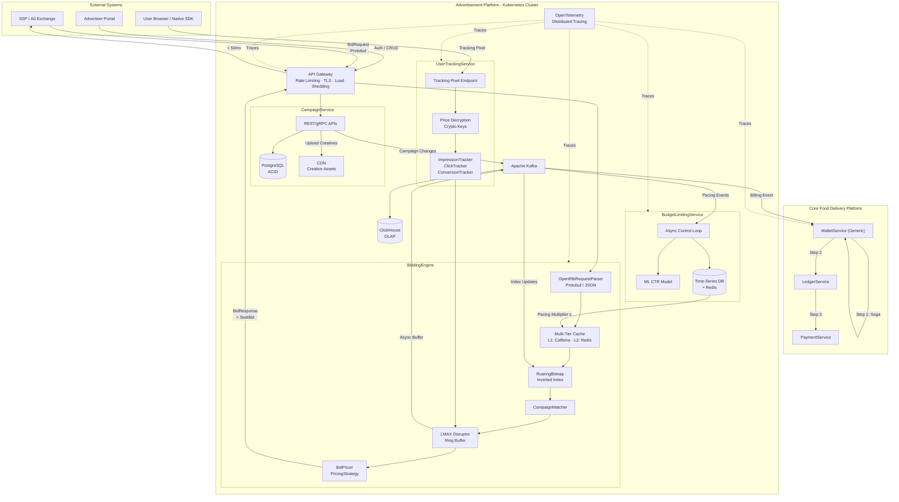
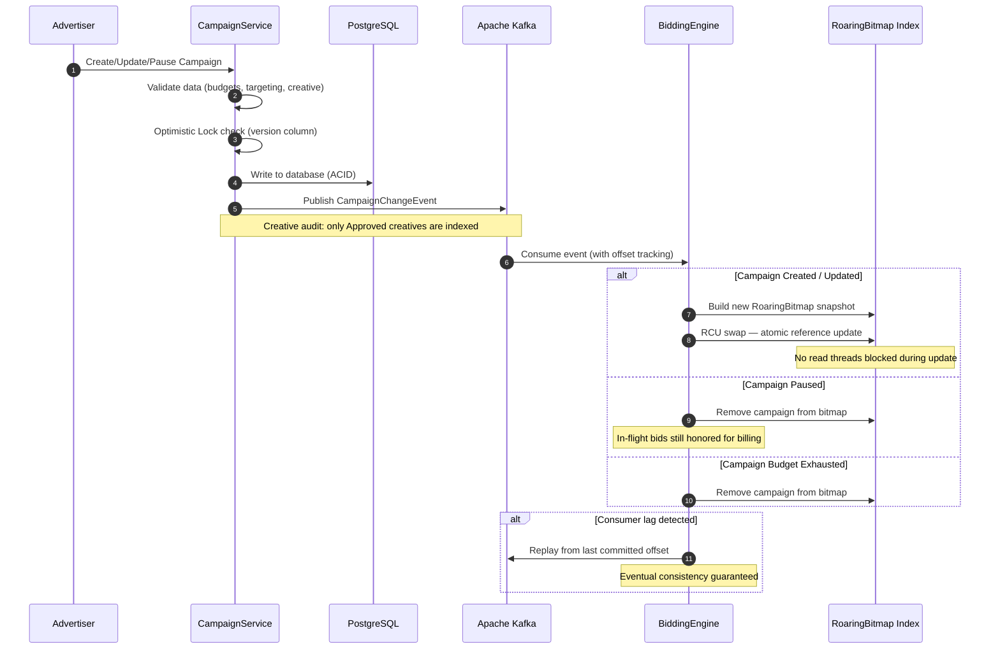

# Campaign Management Service (CampaignService)

## Overview
The `CampaignService` is responsible for all advertiser-facing operations. It acts as the canonical source of truth for advertiser profiles, campaign configurations, and creative assets. It provides a self-serve portal for advertisers to manage their advertising initiatives within the Food Delivery platform.

## High-Level System Architecture
Below is the overview of all 5 bounded contexts and their inter-service communication within the advertisement platform.

## Core Responsibilities
- **Advertiser Profiles**: Management of advertiser registration, authentication, and organizational profiles.
- **Campaign Management**: CRUD operations for Campaigns, Ad Groups, and Ad Creatives (supporting banner, video VAST, and native formats).
- **Targeting Configurations**: Managing contextual, geographic, demographic, and behavioral targeting rules. Supports defining blocklists for brand safety and dayparting rules.
- **Budget Management**: Defining daily and lifetime financial budgets.
- **Creative Storage**: Handling creative asset uploads to object storage (e.g., S3/GCS) fronted by a CDN for low-latency global serving.
- **State Management**: Managing campaign lifecycle states (Active, Paused, Completed, Archived).

## Use Case Validation
The platform is generalized to gracefully handle vastly different use cases without requiring customized deployments:

| Business Entity Profile | Primary Use Case and Campaign Objective | Targeting and Bidding Strategy |
| :--- | :--- | :--- |
| **Local Independent Restaurant** | Drive foot traffic during lunch and dinner hours. | Hyper-local geo-targeting (e.g., 5-mile radius), dayparting (11 AM - 2 PM), contextual food-related inventory. Strict pacing for minimal budget. |
| **National E-Commerce Retailer** | Drive direct online sales and retarget abandoned carts. | Behavioral retargeting using first-party tracking pixels, broad geo-targeting, and Dynamic Creative Optimization (DCO). Relies heavily on bid shading to maximize ROI. |
| **B2B Software Corporation** | Generate high-quality leads and whitepaper downloads. | Demographic targeting, intent-based contextual keywords, high maximum bids for premium publisher inventory. Prioritizes impression quality over volume. |

## Architecture & Integration
The `CampaignService` utilizes a strict ACID PostgreSQL database to maintain decentralized data specific to campaigns and advertisers. It integrates with `RestaurantApplication` via FeignClient for restaurant owners to create and track campaigns.

**Data Flow (Campaign Management → Index Update Flow):**
How campaign changes propagate to the `BiddingEngine`'s in-memory index in real time.

## Resilience & Edge Cases
- **Creative Audit**: Integrates a creative status workflow (Pending → Approved → Rejected). Only approved creatives are indexed by the `BiddingEngine`.
- **Targeting Complexity Limits**: Enforces hard limits on targeting parameters (e.g., max geo-fences) at the API level to prevent RoaringBitmap memory bloat in the `BiddingEngine`.
- **XSS Prevention**: Implements strict HTML sanitization and Content Security Policy (CSP) headers to prevent malicious code injection via ad creatives.
- **Concurrent Updates**: Utilizes Optimistic Locking (version columns) to handle simultaneous administrative updates to the same campaign.
- **In-Flight Bids**: If a campaign is paused while bids are already submitted to exchanges, the system will still honor win notifications and process billing for bids submitted prior to the pause.

## Security & Compliance
- Robust Authentication and Authorization (JWT / OAuth2) for the Advertiser Portal.
- API Gateways handle rate limiting, TLS, and load shedding before requests reach the `CampaignService` APIs.

## Ecosystem Integration Points
How this service integrates with the broader Food Delivery platform:

- **RestaurantApplication**: `RestaurantApplication` calls `CampaignService` via FeignClient to create campaigns, manage budgets, and fetch analytics (`GET /api/v1/campaigns/restaurant/{restaurantId}`).
- **CommunicationService**: Dispatches Kafka events to `platform.notifications.dispatch` when a campaign budget is running low (< 20% remaining), or is auto-paused due to insufficient funds.
- **ApiGateway**: Public routes for `/api/v1/campaigns/**` are mapped directly to this service to serve the frontend portals.
